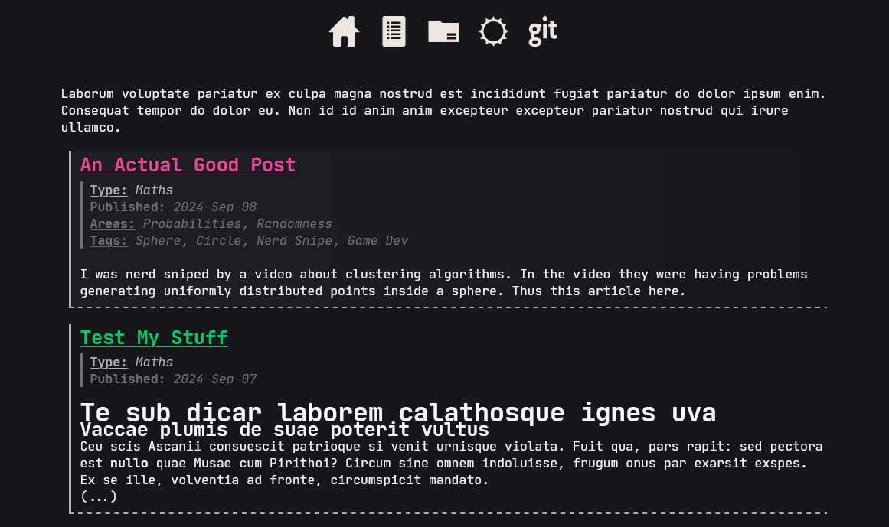
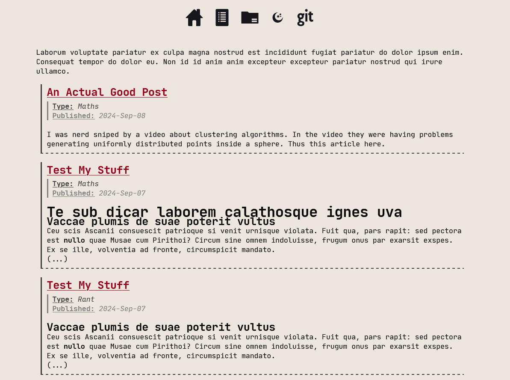

# PostZ FS
This is a [Hugo](https://gohugo.io/) theme designed around the concept of file groups. The aim was to provide file-system-like access to the post groupings and post themselves.

>[!WARNING]
> This theme uses the term "Type" when referring to Hugo "[Section](https://gohugo.io/content-management/sections/)"

## Demos

[~~Live Site~~](#)

Dark mode:


Light mode:


## Customization

>[!TIP]
> For better looking codeblocks use:
> ````markdown
> ```plaintext{linenos=inline}
> code
> code
> code
> ```
> ````

This theme can be customized by changing the `hugo.toml` file, or its equivalent.

Colors can be found in the `./assets/css/definitions.css` file.

This is an example of what the file may look like:

```toml
# custom taxonomies
[taxonomies]
area = "areas"
tag = "tags"

[params]
# enable latex maths rendering - katex
math = true
# use specified favicon
favicon = "/favicon.png"
# author - used for copyright in footer
author = 'Your Name'
# if it exist it adds the git icon to the header
github-page = 'https://github.com/Your-Github-Name'
# do not pluralize or singularize any item in this list when displaying post types
no-inflect-types = ['maths']

[markup.goldmark.renderer]
# allow html in markdown
unsafe = true

[markup.goldmark.extensions.passthrough]
# allow passthrough step needed for latex maths rendering
enable = true

[markup.goldmark.extensions.passthrough.delimiters]
block = [['$$', '$$']]
inline = [['$', '$']]  # this theme allows for inline maths using the following syntax : $a^2+b^2=c^2$
```

## Useful scripts

```bash
# Get current date in the same format hugo can recognize.

date +%Y-%m-%dT%H:%M:%S%:z
```

```sh
# Start hugo server locally

##################################
## get LOCAL_IP if not already set 
## stolen from https://stackoverflow.com/questions/53113171/how-can-i-determine-the-ip-address-from-a-bash-script

## Windows
LOCAL_IP=${LOCAL_IP:-`ipconfig.exe | grep -im1 'IPv4 Address' | cut -d ':' -f2 | sed 's/^\s*//;s/\s*$//'`}

## Linux - NOT TESTED YET
## LOCAL_IP=${LOCAL_IP:-`ifconfig | sed -En 's/127.0.0.1//;s/.*inet (addr:)?(([0-9]*\.){3}[0-9]*).*/\2/p' | sed 's/^\s*//;s/\s*$//'`}

## MacOS - NOT TESTED YET
## LOCAL_IP=${LOCAL_IP:-`ipconfig getifaddr en0 | sed 's/^\s*//;s/\s*$//'`} #en0 for host and en1 for wireless


##################################
## start server
## use 0.0.0.0 to bind so we can use both localhost and the actual local ip to access the site 
## (needed for connectinv via local network)
## use '-D' to display draft posts as well
hugo server --gc --noHTTPCache --watch --disableFastRender --port 1313 --bind 0.0.0.0 --baseURL http://$LOCAL_IP
```